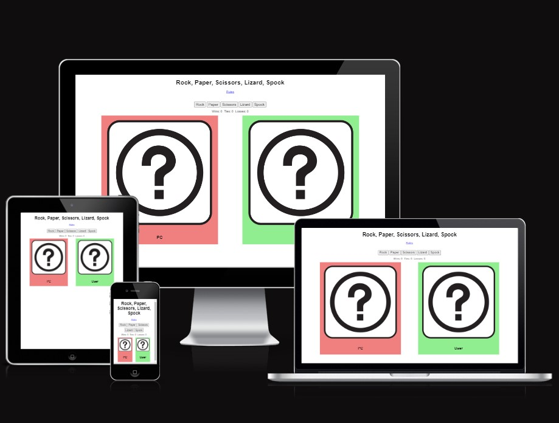
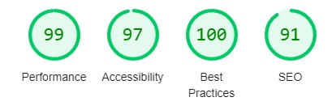

# Rock, Paper, Scissors, Lizard, Spock
"Rock, Paper, Scissors, Lizard, Spock" is a game that allows the user to experience a truly random and more difficult version of the common in-person game "Rock, Paper, Scissors", often used to quicktly pass time or come to a decision about something. 

This version was popularized by the sit-com "The Big Bang Theory" and adds two new options to reduce the chances of ties and giving the players more fun correlations to remember.

This simple app will be targeted to a wide range of adults and children to enjoy and learn from.

## Features

## Testing

<ul>
  <li>I tested playing this game in different browsers: Firefox, Chrome, Edge</li>
  <li>I confirmed the results of the game are consistantly correct.</li>
  <li>I confimed all elements on the page are easily readable and recognizable.</li>
  <li>Using the toolbar in devtools I found the website decently formatted and responsive in all screen sizes.</li>
  <li>I confirmed the colors and fonts chosen are easily recognizable and readable by running it through lighthouse in devtools.</li>
</ul>

### Bugs
None found after deployment

### Validator Testing

<ul>
  <li>
    HTML<ul><li>No errors were found when passing throung the official W3C validator</li></ul>
  </li>
  <li>
    CSS<ul><li>Mo errors wre found when passing it through the official validator</li></ul>
  </li>
</ul>

## Deployment
The website was deployed to GitHub pages. The steps on how to deploy it are:
<ul>
  <li>In the repository on GitHub, open the setting tab</li>
  <li>In the pages sub-tab, select the main branch</li>
  <li>Once the main branch has been selected, the website will present a link to the deployed website</li>
</ul>

## Credits