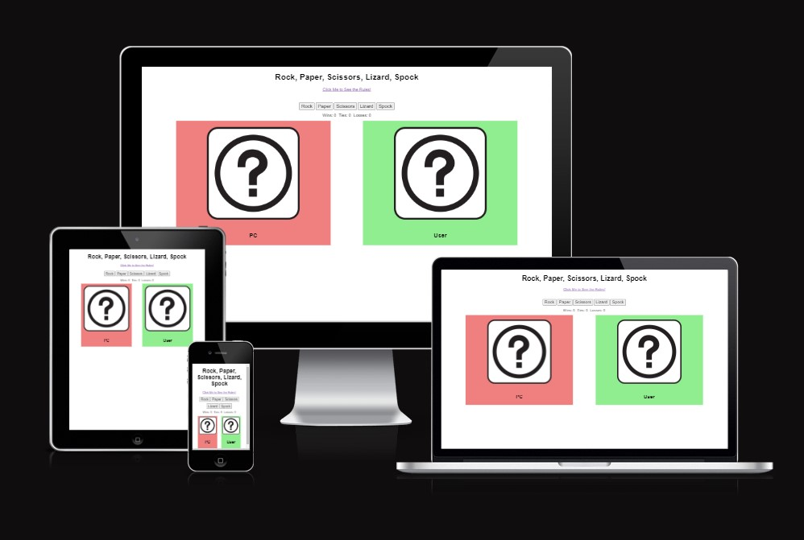

# Rock, Paper, Scissors, Lizard, Spock
"Rock, Paper, Scissors, Lizard, Spock" is a game that allows the user to experience a truly random and more difficult version of the common in-person game "Rock, Paper, Scissors", often used to quicktly pass time or come to a decision about something. 

This version was popularized by the sit-com "The Big Bang Theory" and adds two new options to reduce the chances of ties and giving the players more fun correlations to remember.

This simple app will be targeted to a wide range of adults and children to enjoy and learn from.

## Features

<ul>
<li>Heading</li>
  <ul>
    <li>The heading lets the user know exactly what this website does if they are familiar with this version of the "Rock, Paper, Scissors" game, and gives them a good clue as to it's natue if not.</li>
    <li>The font used is approachable yet still formal. Keying the user in, that this is both a fun and educational experience. </li>
  </ul>

  

  <li>Navigation to the Rules</li>
  <ul>
    <li>Small yet easily spotible link brings the user to the page with a picture depicting the rules.</li>
    <li>The text in the link motivates the user to look at the rules before playing, if they are unfamiliar.</li>
  </ul>

  

  <li>The Game Area</li>
  <ul>
    <li>Two question marks act as placeholders for where the images of the results will later be displayed.</li>
    <li>Five buttons represent the five options the player has to chose from.</li>
    <li>Upon clicking their button of choice an alert will apear with the result of the game.Win, Loss, or Tie</li>
    <li>After the alert is clicked away. The scoreboard under the buttons will add the result.</li>
    <li>In the green box on the right the players choice will be reflected by an image of the hand gesture that represents their choice.</li>
    <li>In the red box on the left, an image representing the hand geture corresponing to the computers randomly chosen option will be shown.</li>
  </ul>

  

  <li>Navigation to the Game</li>
  <ul>
    <li>After clicking the link to the rules page, the link to go back to the game is located in the location as the link to the rules, making it easy for the user to find.</li>
    <li>The language of the link entices the user to play the game after being familiarized with the rules.</li>
  </ul>

  

  <li>The Rules Area</li>
  <ul>
    <li>An easily understandable image communicates the rules of the game.</li>
    <li>It displays all the hand gestures that will be used in the course of the game.</li>
  </ul>

  

</ul>

## Testing

<ul>
  <li>I tested playing this game in different browsers: Firefox, Chrome, Edge</li>
  <li>I confirmed the results of the game are consistantly correct.</li>
  <li>I confimed all elements on the page are easily readable and recognizable.</li>
  <li>Using the toolbar in devtools I found the website decently formatted and responsive in all screen sizes.</li>
  <li>I confirmed the colors and fonts chosen are easily recognizable and readable by running it through lighthouse in devtools.</li>
</ul>

### Bugs
None found after deployment

### Validator Testing

<ul>
  <li>
    HTML<ul><li>No errors were found when passing throung the official W3C validator</li></ul>
  </li>
  <li>
    CSS<ul><li>Mo errors wre found when passing it through the official validator</li></ul>
  </li>
</ul>

## Deployment
The website was deployed to GitHub pages. The steps on how to deploy it are:
<ul>
  <li>In the repository on GitHub, open the setting tab</li>
  <li>In the pages sub-tab, select the main branch</li>
  <li>Once the main branch has been selected, the website will present a link to the deployed website</li>
</ul>

## Credits